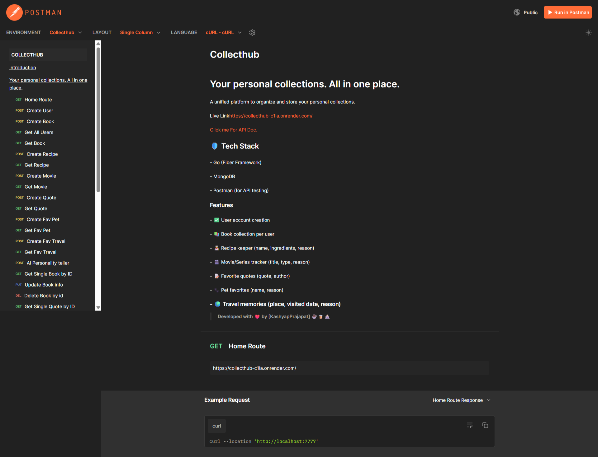
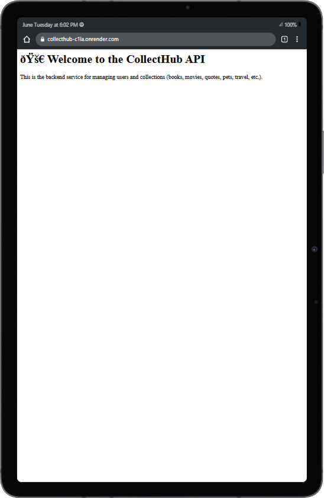
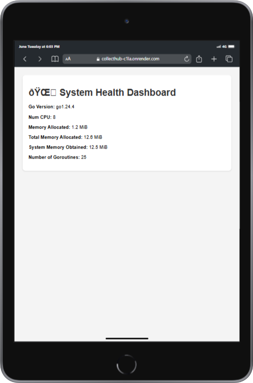
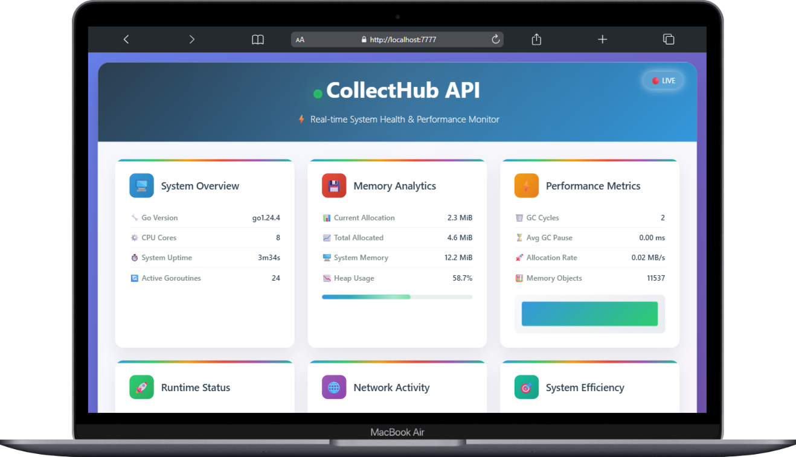
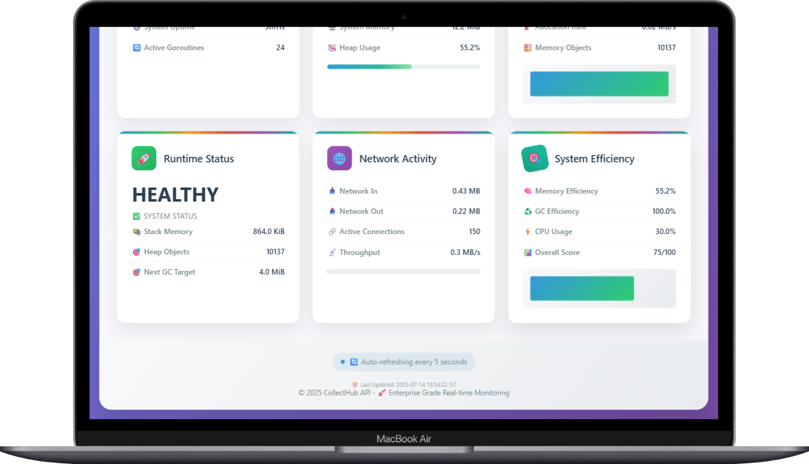
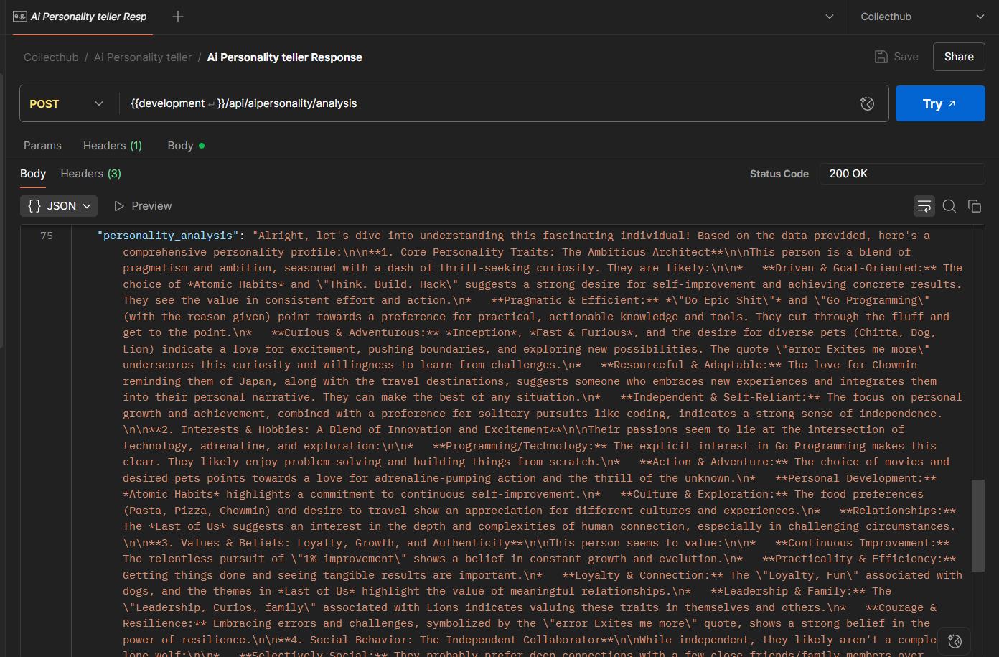

# CollectHub 🎒📃

## Your personal collections. All in one place.

### A unified platform to organize and store your personal collections.     

---

Api Documenataion 👨🏻‍💻 --> https://documenter.getpostman.com/view/36611651/2sB2x8Grko



---

## 🚀 Features

- ✅ User account creation
- 📚 Book collection per user
- 🧑‍🍳 Recipe keeper (name, ingredients, reason)
- 🎬 Movie/Series tracker (title, type, reason)
- 📝 Favorite quotes (quote, author)
- 🐾 Pet favorites (name, reason)
- 🌍 Travel memories (place, visited date, reason)
- 🅰️ Ai personality teller
- 📝 In All CRUD Operation Avilable.

---
## API Glimps

| Home 🏠 | Health 📈 |
|--------|--------|
|  |  |


---
#### API Health Routes

|  |  |
|--------|--------|
|  |  |

---
## 📦 Project Structure

```
CollectHub_api/
├── controllers/        # All controller files (book, user, recipe, etc.)
├── models/             # MongoDB models for each collection
├── routes/             # API routes setup
├── .env                # Environment variables (MongoDB URI, Port, etc.)
├── go.mod              # Go module file
├── go.sum              # Go dependencies
├── main.go             # Entry point of the app
├── README.md           # Project documentation
```
---

## ⚙️ Setup Instructions

1. **Clone the Repository**
```bash
git clone https://github.com/kashyapprajapat/CollectHub.git
cd CollectHub
```

2. **Add `.env` File**
```
MONGO_URI=your_mongodb_connection_uri
MONGO_DB=collecthub
PORT=7777
GEMINI_API_KEY=yourGemaaiapikey
```

3. **Run the Server**
```bash
go run main.go
```

---

## 🧪 Testing with Postman

### 1. Create User
**POST** `/api/users`
```json
{ "name": "John Doe", "email": "john@example.com" }
```

### 2. Create Book
**POST** `/api/books`
```json
{ "name": "Go Programming", "author": "Alan", "reason": "For Go learning", "user_id": "<userId>" }
```

### 3. Create Recipe
**POST** `/api/recipes`
```json
{ "name": "Pasta", "ingredients": "Tomato, Basil", "reason": "Delicious", "user_id": "<userId>" }
```

### 4. Create Movie
**POST** `/api/movies`
```json
{ "title": "Inception", "type": "Movie", "reason": "Mind-blowing", "user_id": "<userId>" }
```

### 5. Create Quote
**POST** `/api/quotes`
```json
{ "quote": "Stay hungry", "author": "Steve Jobs", "user_id": "<userId>" }
```

### 6. Create Pet
**POST** `/api/pets`
```json
{ "name": "Buddy", "reason": "Loyal", "user_id": "<userId>" }
```

### 7. Create Travel
**POST** `/api/travels`
```json
{ "place": "Paris", "visited_date": "2023-12-01", "reason": "Beautiful", "user_id": "<userId>" }
```

---

## 📄 API Home

Visit [http://localhost:7777](http://localhost:7777) to view the HTML home message.

---

## 🛡️ Tech Stack

- Go (Fiber Framework)
- MongoDB
- Postman (for API testing)
- Gemini API (Ai Personality)

---

### Ai Personality Response



---
## 🙌 Acknowledgements

Developed with ❤️ by [Kashyap Prajapat] ☕🧋👨🏻‍💻